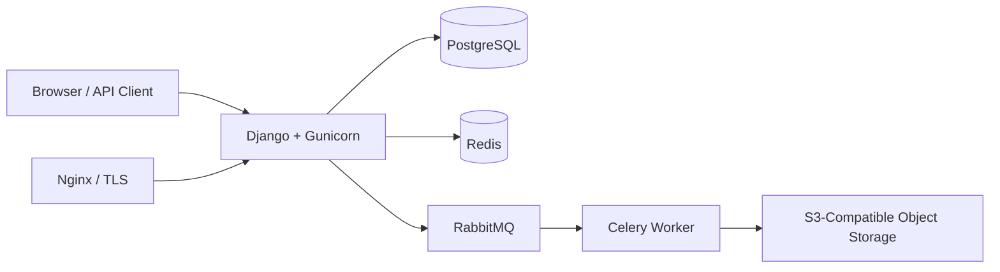

# Online Shop

A Dockerized Django e-commerce application with product and inventory management, role-aware user flows, order and payment handling, wishlist APIs, background tasks, and S3-compatible object storage.

## Highlights

* Role-aware authentication, profiles, addresses, and account management
* Product catalog with categories, brands, inventory, media, discounts, comments, and wishlists
* Order creation, payment flow, and verification endpoints
* Django REST Framework endpoints for wishlist operations
* Asynchronous jobs with Celery and RabbitMQ
* Redis for caching and Celery result storage
* PostgreSQL persistence
* S3-compatible object storage integration through `boto3` and `django-storages`
* Docker Compose environment with health checks and non-root application containers
* Locked dependencies managed with Poetry; `requirements.txt` is generated from `poetry.lock`

## Architecture



## Technology Stack

| Area                     | Tools                                             |
| ------------------------ | ------------------------------------------------- |
| Backend                  | Python 3.12, Django, Django REST Framework        |
| Database                 | PostgreSQL                                        |
| Async processing         | Celery, RabbitMQ                                  |
| Caching / result backend | Redis                                             |
| Storage                  | `boto3`, `django-storages`, S3-compatible storage |
| Authentication           | Django authentication, JWT via SimpleJWT          |
| Runtime                  | Gunicorn, Docker, Docker Compose                  |
| Tooling                  | Poetry, Ruff, isort, pre-commit                   |
| Admin                    | Django Jazzmin                                    |

## Project Structure

```text
apps/
├── account/      # users, roles, authentication, addresses, tokens
├── core/         # shared utilities, OTP/SMS helpers, management commands
├── order/        # carts, orders, payments, payment verification
├── product/      # catalog, inventory, brands, categories, discounts, wishlists
└── public/       # public pages, home page, login flows

config/           # Django settings, URLs, Celery configuration
utility/
├── bucket/       # object-storage integration and related tasks
└── bin/          # Docker entrypoint scripts
```

## Local Development with Docker

### 1. Clone the repository

```bash
git clone https://github.com/pedramkarimii/Online-Shop.git
cd Online-Shop
```

### 2. Create local environment configuration

```bash
cp .env.example .env
```

Edit `.env` and replace development placeholders before starting the stack. Never commit `.env`.

When PostgreSQL port `5432` is already in use, set a different host port in `.env`:

```env
POSTGRES_HOST_PORT=55432
```

### 3. Validate Compose configuration

```bash
docker compose config --quiet
```

### 4. Start application services

```bash
docker compose up --build app celery-worker
```

The application is available at:

```text
http://127.0.0.1:8000/
```

Stop the local stack with:

```bash
docker compose down
```

## Poetry Workflow

Install runtime and development dependencies:

```bash
poetry install --with dev
```

Run Django checks:

```bash
poetry run python manage.py check
poetry run python manage.py makemigrations --check --dry-run
```

Run linting:

```bash
poetry run ruff check .
```

Generate runtime requirements from the lock file:

```bash
poetry export \
  --only main \
  --format requirements.txt \
  --without-hashes \
  --output requirements.txt
```

`requirements.txt` must remain synchronized with `poetry.lock`.

## Verification Commands

Run dependency consistency checks inside the application image:

```bash
docker compose build app

docker compose run --rm --no-deps \
  --entrypoint sh \
  app \
  -c 'python -m pip check && python manage.py check'
```

Run Django migrations as a plan without applying changes:

```bash
docker compose up -d db

docker compose run --rm --no-deps \
  --entrypoint sh \
  app \
  -c 'python manage.py migrate --plan'
```

## Tests

The repository contains model, view, token, and Selenium-oriented test modules across the account, order, product, and public applications.

Run Django tests with configured services available:

```bash
poetry run python manage.py test
```

Selenium-focused tests require a compatible browser and WebDriver environment.

## Security Notes

* Real credentials are excluded from version control through `.gitignore`.
* `.env.example` contains placeholders only.
* Docker application containers run as a non-root user.
* Dependency versions are locked with Poetry.
* Run an audit against runtime dependencies:

```bash
pip-audit -r requirements.txt
```

## Entity Relationship Diagram

[Open the ERD document](ERD/ERD_Online_Shop.pdf)

## Contributing

1. Create a branch from `develop`.
2. Keep `.env` files and secrets out of commits.
3. Run formatting, linting, and Django checks.
4. Submit a focused pull request with a clear description.

## License

This project is licensed under the MIT License. See [LICENSE](LICENSE).
